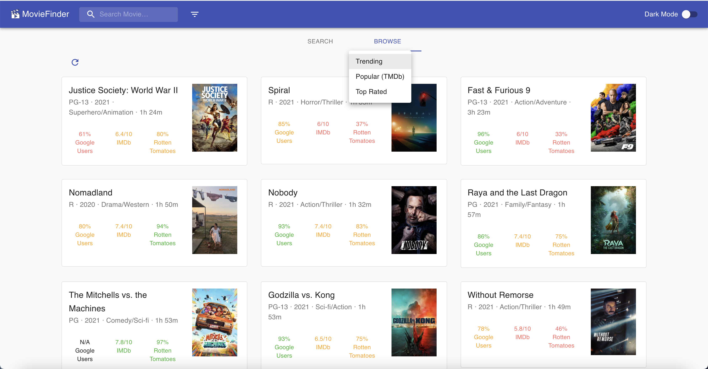
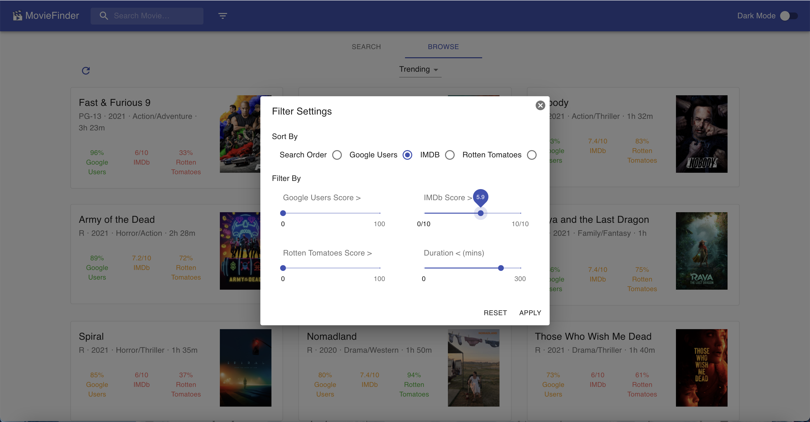
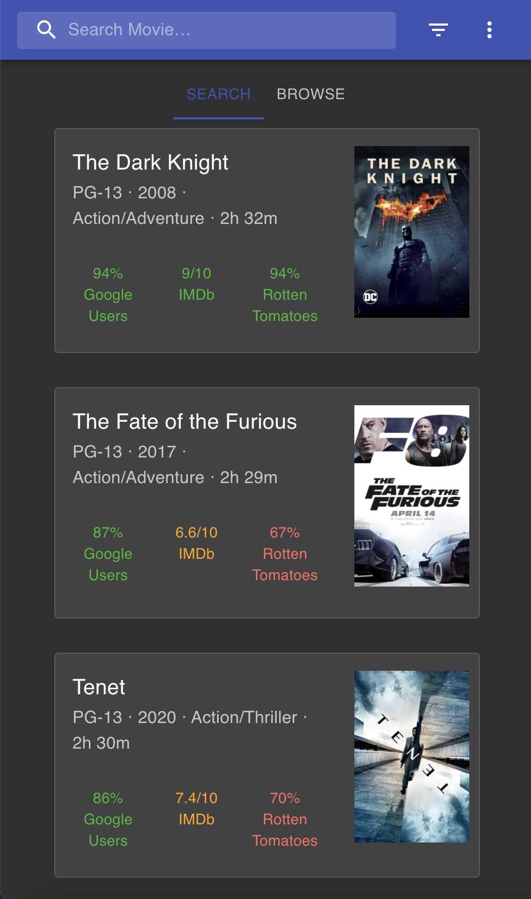

# MovieFinder

Ever wanted to watch something on Netflix but had trouble deciding which movie to watch? MovieFinder allows you to search for, filter and compare movies based on ratings across multiple categories (such as IMDb, Rotten Tomatoes, or Google Users rating), allowing you to easily identify high-quality and well-rated movies to watch. Additionally, browse movies across multiple categories such as trending, popular or top rated.

Search and browse popular and top rated movies and compare them based on rating.

Filter through movies using custom filtering and sorting criteria.

Watch trailers and view additional movie information by clicking on a movie.

Mobile-compatible and supports dark mode as well.

## Technologies Used

Frontend: React.js and Material UI

Backend: Google web scraping for ratings, trailer, and movie info, tmdb for movie summaries and popular movie lists, Google Chrome cache to cache data for faster browsing

## Deployment
